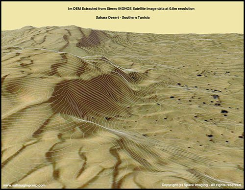
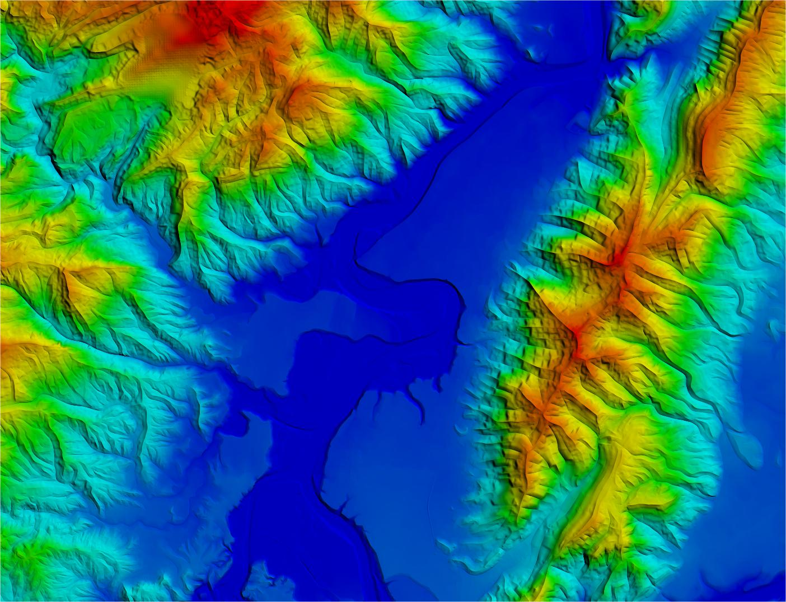
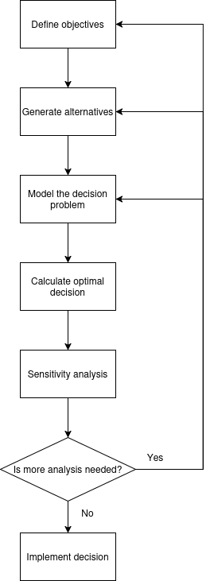
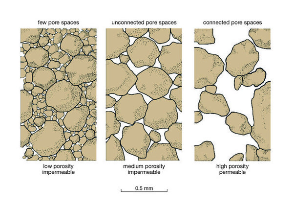
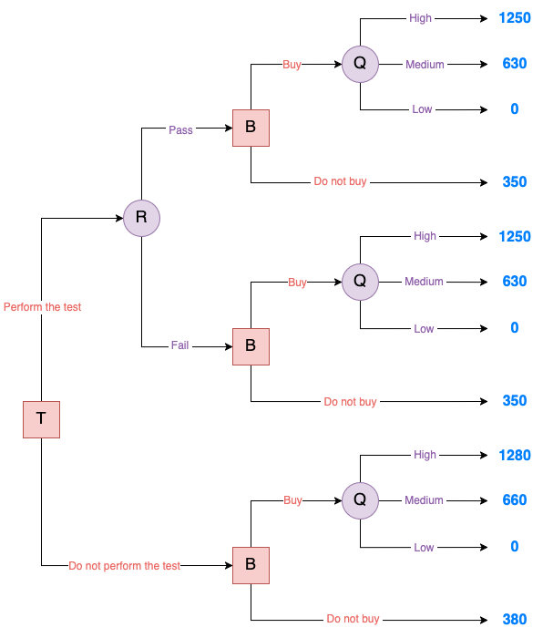
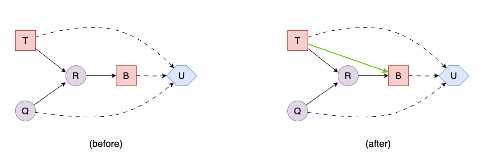
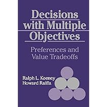
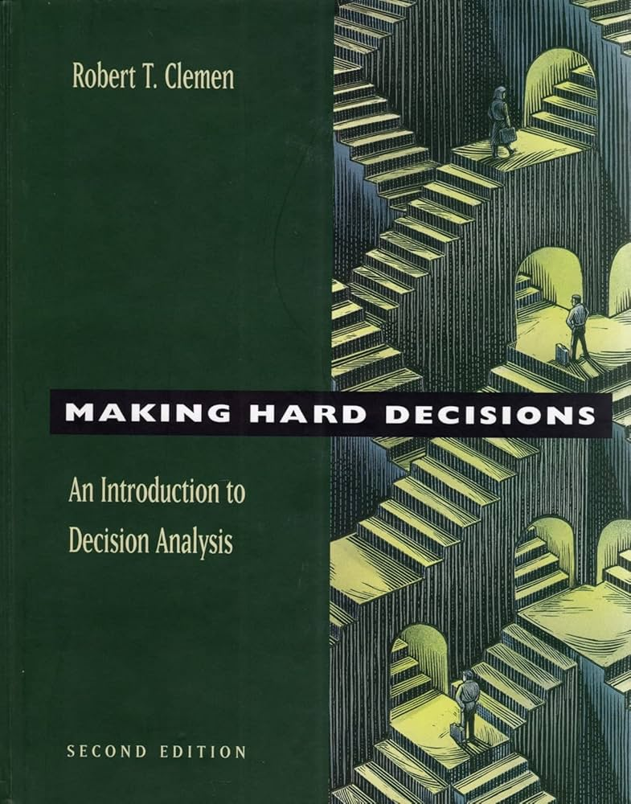
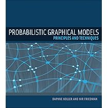
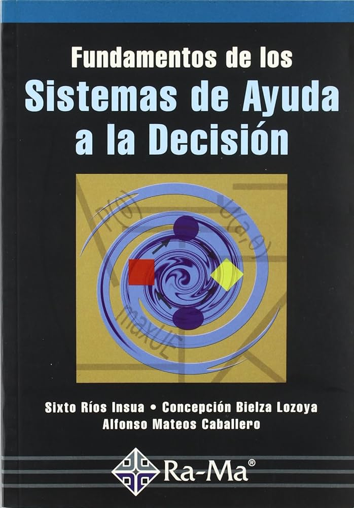

> This is the first of a series of posts where we explore **decision theory**:
> 1. **Introduction to Decision Theory**

## The Challenge of Decision-Making

Imagine you're the CEO of an oil company, and you're considering whether to buy a new field. The problem? You don't know how much oil is really there.

Before signing any contract, you gather the information you can: high-resolution satellite images, geological surveys from third parties, and your team's prior experiences with similar fields. Each piece of evidence nudges your belief—your prior—about which quality grade you'll actually find. But no amount of remote sensing can guarantee what you'll hit when you start drilling. Should you play it safe and walk away? Or place your bet and hope the data don't betray you?

<table>
  <tr>
    <td>
      
    </td>
    <td>
      
    </td>
  </tr>
  <tr>
    <td colspan="2" align="center">
      <i><b>Figure 1.</b> Satellite imagery and heatmap of the oil field</i>
    </td>
  </tr>
</table>

This tension between what you know, what you don't know, and what you value is at the heart of every important decision. How do you weigh the potential upside against the risk of a bad draw? How much should your imperfect information—your priors—count in the final call? 

Decision theory offers a language and a framework to answer exactly these questions: by systematically combining probabilities (your beliefs) with utilities (your preferences over outcomes), it tells you which action maximizes your expected benefit.

Let's return to the oil field example. Suppose you classify the field into three possible quality levels:

* High: Massive reserves, huge profits.

* Medium: Decent output, but not groundbreaking.

* Low: Barely enough to break even (or worse, a loss).

The dilemma is clear:

* If you buy and the field is high-quality, you win big.

* If you buy and it's low-quality, you lose money.

* If you don't buy, you avoid risk—but might miss out on a golden opportunity.

## The Anatomy of a Decision Problem

To make decisions more systematically, we first need to break them down into parts. Decision theory gives us a clear structure for doing this. Any decision problem, no matter how complex, can be described using a few key components:

* Actions – the choices available to the decision-maker

* States of nature – the uncertain factors that affect the outcome

* Probabilities – the decision-maker's beliefs about how likely each state is

* Outcomes – the result of taking an action in a particular state

## Structuring the Oil field Decision Problem

Now that we've outlined the problem, let's break it down using decision theory.

### A. Possible actions

The company has two primary options:

* Buy the oil field – Invest capital now for potential future profits.

* Do not buy – Avoid risk, but potentially miss out on gains.

### B. States of nature

The true quality of the field, which we classify into three groups: high, medium, or low.

### C. Probabilities

The company doesn't know the field's true quality. However, it can estimate probabilities based on available data:

* High quality (35% chance).

* Medium quality (45% chance).

* Low quality (20% chance).

### D. Outcomes (in $M)

<table align="center">
  <tr>
    <th>Action</th>
    <th>Field Quality</th>
    <th>Outcome</th>
  </tr>
  <tr>
    <td>Buy</td>
    <td>High</td>
    <td>+$1,250</td>
  </tr>
  <tr>
    <td>Buy</td>
    <td>Medium</td>
    <td>+$630</td>
  </tr>
  <tr>
    <td>Buy</td>
    <td>Low</td>
    <td>$0</td>
  </tr>
  <tr>
    <td>Do not buy</td>
    <td>Any</td>
    <td>+$350</td>
  </tr>
</table>

> ❓ *Why is there a profit for not buying?*
>
> This could represent a baseline alternative, like investing the capital elsewhere for a guaranteed return of $350M.

## Calculating Expected Monetary Value

The Expected Monetary Value (EMV) of buying accounts for all possible outcomes:

$$ EMV(\text{Buy}) = (0.35 \times \$1,250\text{M}) + (0.45 \times \$630\text{M}) + (0.20 \times \$0\text{M}) = \$437.5\text{M} + \$283.5\text{M} + \$0\text{M} = \$721\text{M} $$

Compare this to the alternative:

$$ EMV(\text{Do not buy}) = \$350\text{M} $$

Decision: Buying has a higher expected value ($721M vs. $350M).

## Beyond Money: Utility and Risk Preferences

But what if getting $0M from a low-quality field would severely impact the company's operations, while the difference between $630M and $1,250M is less critical? EMV assumes that each additional dollar has the same value, but real-world decision-makers often have more nuanced preferences.

This is where utility theory comes in (to be covered in a future post):

* A risk-averse company might prefer the guaranteed $350M over a 35% chance of $1,250M
* A risk-seeking company might be drawn to that 35% chance of a $1,250M windfall

## Decision Analysis: A Dynamic, Iterative Process

Decision-making isn't a one-shot task—it's a cycle of refinement. As new information emerges or priorities shift, we revisit and update our analysis. Here's the structured flow:

<table>
  <tr>
    <td>
      
    </td>
  </tr>
  <tr>
    <td align="center">
      <i><b>Figure 2.</b> Flow diagram of the decision analysis process</i>
    </td>
  </tr>
</table>

1. **Define Objectives**: Break down the global objective (e.g., "Maximize long-term profits") into specific, measurable sub-objectives.

    *Example for oil company:*
    - Goal: Maximize the company's profit from the oil field
    - Sub-objectives:
        - Minimize downside risk
        - Limit upfront cost
        - Align with strategic reserves

2. **Generate Alternatives**: Brainstorm all feasible actions—not just obvious ones.

    *Example for oil company:*
    - Buy the field
    - Don't buy
    - **New:** Delay decision and commission an extra study

3. **Model the Decision Problem**: Structure uncertainty, outcomes and preferences.

    *Example for oil company:*
    - Define states (field quality: high/medium/low)
    - Assign probabilities (35%/45%/20%)
    - Map outcomes to utilities (e.g., profit values)

    **Toolkit:** Decision trees, influence diagrams

4. **Calculate Optimal Decision**: Compute expected utilities and select the best action.

    *Example for oil company:*
    
    $$ EU(Buy) = (0.35 \times 1250) + (0.45 \times 630) + (0.20 \times 0) = 721 $$
    
    $$ EMV(\text{Do not buy}) = \$350 $$
    
    Optimal choice: Buy (721 > 350)

5. **Sensitivity Analysis**: Test robustness by perturbing key inputs.

    *Example for oil company:*

    What if "high quality" probability drops to 25%?
    
    $$ EU(Buy) = (0.25 \times 1250) + (0.55 \times 630) + (0.20 \times 0) = 616.5 $$
    
    → Still better than $350M (robust)

    What if "low quality" outcome worsens to $-200M$?
    
    $$ EU(Buy) = (0.35 \times 1250) + (0.45 \times 630) + (0.20 \times -200) = 681.5 $$
    
    → Still optimal, but riskier

6. **Implement or Iterate**

    Decision point:
    - If satisfied (optimal choice is robust and aligns with objectives) → Implement
    - If not → Revisit earlier phases

    *Example for oil company:*
    
    Triggers for iteration:
    - Uncertainty too high? → Gather more data (e.g., seismic tests)
    - Missing variables? → Add environmental/social costs
    - New alternatives? → Explore partnerships

## When New Information Becomes an Option

Just as the company is about to move forward, a new opportunity arises: it can choose to perform a geological test before deciding whether to purchase the oil field. This test doesn't reveal the true quality of the field directly—it provides a report on the porosity of the reservoir rock. High porosity often suggests greater oil potential, but the test is imperfect, and its results come with uncertainty.

<table>
  <tr>
    <td>
      
    </td>
  </tr>
  <tr>
    <td align="center">
      <i><b>Figure 3.</b> Reservoir quality illustrated through porosity and permeability characteristics</i>
    </td>
  </tr>
</table>

The test has two possible outcomes:

* Pass: Porosity is ≥ 15%, indicating significant percentage of pore (void)space in the rocks that can hold fluids like oil or gas.
* Fail: Porosity is < 15%, indicating lower void space and thus lower oil potential.

The test itself comes at a cost, and even after receiving its result, the company will still need to decide whether to proceed with the purchase. So now, instead of a single decision, we have two decisions in sequence:

* Should we perform the test?
* Depending on the result, should we buy the field?

This two-stage problem—with interdependent decisions and probabilistic updates—can't be solved with simple payoff tables. We'll need:

* Decision trees (not to be confused with the ones used in machine learning), which map out possible actions, chance events, and outcomes in a step-by-step visual format.

<table>
  <tr>
    <td>
      
    </td>
  </tr>
  <tr>
    <td align="center">
      <i><b>Figure 4.</b> Oil decision tree</i>
    </td>
  </tr>
</table>

* Decision networks (or influence diagrams), which provide a more compact and flexible way to represent complex decision problems with multiple variables and dependencies.

<table>
  <tr>
    <td>
      
    </td>
  </tr>
  <tr>
    <td align="center">
      <i><b>Figure 5.</b> Oil decision network, before and after introducing memory arcs</i>
    </td>
  </tr>
</table>

## Where to Read More

<table>
  <tr>
    <th>Book Cover</th>
    <th>Reference</th>
    <th>Key Focus</th>
  </tr>
  <tr>
    <td></td>
    <td><strong>Howard & Matheson (1983)</strong> <em>Readings on Decision Analysis</em> DOI: 10.1287/opre.31.4.813</td>
    <td>Classic collection of papers on decision analysis methodology and applications</td>
  </tr>
  <tr>
    <td></td>
    <td><strong>Robert T. Clemens (1995)</strong> <em>Making Hard Decisions</em> ISBN: 978-0534260347</td>
    <td>Practical guide to structuring decisions and handling uncertainty with real-world examples</td>
  </tr>
  <tr>
    <td></td>
    <td><strong>Russell & Norvig (2010)</strong> <em>AI: A Modern Approach</em> (Ch. 16) ISBN: 978-0134610993</td>
    <td>Decision Theory & Decision Networks</td>
  </tr>
  <tr>
    <td></td>
    <td><strong>Koller & Friedman (2009)</strong> <em>Probabilistic Graphical Models</em> (Ch. 22, 23) ISBN: 978-0262013192</td>
    <td>Advanced coverage of decision networks and their integration with probabilistic reasoning</td>
  </tr>
  <tr>
    <td></td>
    <td><strong>Ríos Insua et al. (2002)</strong> <em>Fundamentos de los Sistemas de Ayuda a la Decisión</em> ISBN: 978-8478972746</td>
    <td>Comprehensive introduction to decision support systems with emphasis on theoretical foundations</td>
  </tr>
</table>

## Next Post

In Part II, we'll:

1. Build and solve a decision tree for the oil field problem, incorporating the geological test

2. Present the limitations of Decision Trees and why decision networks may be preferred in certain situations.